# Інструкція користувача — RentGo

**RentGo** — двостороння peer-to-peer платформа для короткострокової оренди речей в Україні. Платформа з'єднує **власників**, які хочуть здавати своє майно в оренду, з **орендарями**, яким річ потрібна на обмежений час (дриль, намет, камера, велосипед тощо).

Ця інструкція складається з двох частин:

1. **Встановлення та розгортання** — як підготувати середовище й запустити продукт.
2. **Використання** — повний опис усіх функцій і можливостей платформи.

> 💡 **Швидкий доступ.** Платформа вже задеплоєна — користуватися нею можна без локального встановлення, просто відкривши у браузері:
> **[https://w-team-sooty.vercel.app](https://w-team-sooty.vercel.app/)**
> Детальніше — у розділі [1.8. Онлайн-доступ](#18-онлайн-доступ-задеплоєна-версія).

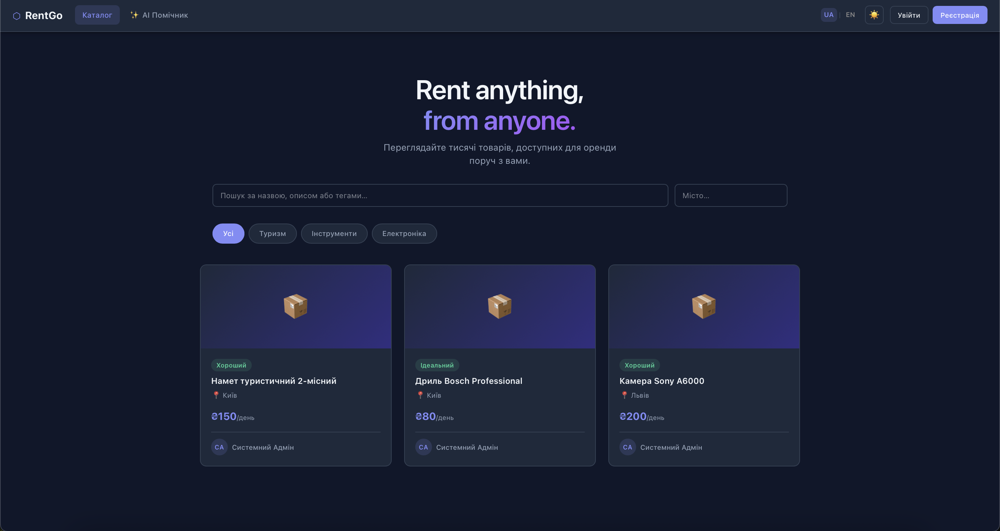

*Скріншот 1. Головна сторінка (каталог) у браузері — загальний вигляд платформи.*

---

## Зміст

- [Частина 1. Встановлення та розгортання](#частина-1-встановлення-та-розгортання)
  - [1.1. Системні вимоги](#11-системні-вимоги)
  - [1.2. Отримання вихідного коду](#12-отримання-вихідного-коду)
  - [1.3. Налаштування змінних оточення](#13-налаштування-змінних-оточення)
  - [1.4. Запуск інфраструктури (PostgreSQL, Kafka)](#14-запуск-інфраструктури-postgresql-kafka)
  - [1.5. Запуск бекенду](#15-запуск-бекенду)
  - [1.6. Запуск фронтенду](#16-запуск-фронтенду)
  - [1.7. Перевірка та доступи](#17-перевірка-та-доступи)
  - [1.8. Онлайн-доступ (задеплоєна версія)](#18-онлайн-доступ-задеплоєна-версія)
- [Частина 2. Використання платформи](#частина-2-використання-платформи)
  - [2.1. Загальний інтерфейс](#21-загальний-інтерфейс)
  - [2.2. Реєстрація та вхід](#22-реєстрація-та-вхід)
  - [2.3. Каталог і пошук речей](#23-каталог-і-пошук-речей)
  - [2.4. Сторінка речі](#24-сторінка-речі)
  - [2.5. Бронювання та календар доступності](#25-бронювання-та-календар-доступності)
  - [2.6. Додавання та редагування власних оголошень](#26-додавання-та-редагування-власних-оголошень)
  - [2.7. Мої оголошення](#27-мої-речі)
  - [2.8. Мої бронювання (орендар і власник)](#28-мої-бронювання-орендар-і-власник)
  - [2.9. Оплата бронювання (LiqPay)](#29-оплата-бронювання-liqpay)
  - [2.10. Чати](#210-чати)
  - [2.11. AI-асистент](#211-ai-асистент)
  - [2.12. Профіль і верифікація](#212-профіль-і-верифікація)
  - [2.13. Відгуки та система довіри](#213-відгуки-та-система-довіри)
  - [2.14. Адміністративна панель](#214-адміністративна-панель)
- [Додаток. Типові проблеми](#додаток-типові-проблеми)

---

# Частина 1. Встановлення та розгортання

Продукт складається з трьох частин:

- **Бекенд** — Java Spring Boot (REST API на `http://localhost:8080`, базовий шлях `/api/v1`);
- **Фронтенд** — React + TypeScript (Vite, за замовчуванням `http://localhost:5173`);
- **Інфраструктура** — PostgreSQL та Apache Kafka, які піднімаються через Docker Compose.

## 1.1. Системні вимоги

| Компонент | Версія | Призначення |
|---|---|---|
| **Docker + Docker Compose** | актуальна | Запуск PostgreSQL та Kafka |
| **JDK (Temurin)** | 25.0.1 | Збірка та запуск бекенду |
| **Node.js** | 22+ | Запуск фронтенду |
| **pnpm** | 11+ | Менеджер пакетів фронтенду |
| **Git** | актуальна | Отримання вихідного коду |

> Версію Java зафіксовано у файлі `backend/.tool-versions` (`java temurin-25.0.1`). Рекомендується використовувати менеджер версій (наприклад, `asdf` або `sdkman`).

## 1.2. Отримання вихідного коду

```bash
git clone <URL-репозиторію> WTeam
cd WTeam
```

Структура проєкту:

```text
WTeam/
├── backend/      # Spring Boot API
├── frontend/     # React SPA
└── README.md
```

## 1.3. Налаштування змінних оточення

Бекенд читає налаштування з файлу `backend/.env`. Створіть або відредагуйте його, заповнивши ключові параметри:

```dotenv
# Профіль запуску
SPRING_PROFILES_ACTIVE=dev

# База даних (локальний PostgreSQL із docker compose)
DB_HOST=localhost
DB_PORT=5432
DB_NAME=rentgo
DB_USERNAME=postgres
DB_PASSWORD=postgres

# JWT
JWT_SIGNING_KEY=<довгий-секретний-ключ>
JWT_EXPIRATION=900000

# Google OAuth2 (опційно, для входу через Google)
OAUTH2_CLIENT_ID=<client-id>
OAUTH2_CLIENT_SECRET=<client-secret>

# AI-асистент
OPENAI_API_KEY=<ключ>

# Поштові сповіщення (опційно)
MAIL_USERNAME=<email>
MAIL_PASSWORD=<пароль-застосунку>

# Хмарне сховище зображень (Cloudinary) — для завантаження фото речей
CLOUDINARY_CLOUD_NAME=<cloud-name>
CLOUDINARY_API_KEY=<api-key>
CLOUDINARY_API_SECRET=<api-secret>
```

> ⚠️ Файл `.env` містить секрети — зберігайте його обережно. Параметри `OAUTH2_*`, `OPENAI_API_KEY`, `MAIL_*` та `CLOUDINARY_*` опційні: без них працюватиме все, крім відповідної функції (вхід через Google, AI-асистент, поштові сповіщення, завантаження фото речей).

## 1.4. Запуск інфраструктури (PostgreSQL, Kafka)

З каталогу `backend/` підніміть контейнери:

```bash
cd backend
docker compose up -d
```

Буде запущено два контейнери:

- `wteam_container` — PostgreSQL 17 на порту `5432`;
- `wteam_kafka_container` — Apache Kafka на порту `9092`.

Перевірити стан:

```bash
docker compose ps
```

## 1.5. Запуск бекенду

З каталогу `backend/`:

```bash
./gradlew bootRun
```

Під час першого запуску застосунок виконає міграції бази даних (схема + початкові дані, зокрема категорії та тестовий адміністратор). Після старту API доступне за адресою `http://localhost:8080/api/v1`.

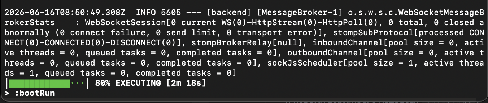

*Скріншот 2. Лог успішного старту бекенду в терміналі (рядок про запуск на порту 8080).*

## 1.6. Запуск фронтенду

У новому терміналі з каталогу `frontend/`:

```bash
cd frontend
pnpm install
pnpm dev
```

Vite запустить застосунок за адресою `http://localhost:5173`. Фронтенд звертається до бекенду за адресою з `frontend/src/constants.ts` (`API_BASE = http://localhost:8080/api/v1`).

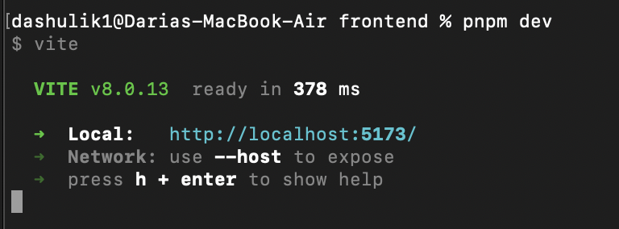

*Скріншот 3. Термінал із запущеним Vite (рядок `Local: http://localhost:5173`).*

## 1.7. Перевірка та доступи

| Ресурс | Адреса |
|---|---|
| Веб-інтерфейс (фронтенд) | `http://localhost:5173` |
| REST API | `http://localhost:8080/api/v1` |
| Swagger / OpenAPI документація | `http://localhost:8080/api/v1/swagger-ui.html` |
| OpenAPI-специфікація (JSON) | `http://localhost:8080/api/v1/v3/api-docs` |

**Тестовий обліковий запис адміністратора (локальне середовище):**

- Email: `admin@gmail.com`
- Пароль: `12345678`

Відкрийте `http://localhost:5173` у браузері — продукт готовий до використання.

## 1.8. Онлайн-доступ (задеплоєна версія)

Окрім локального запуску, платформа доступна онлайн — встановлювати нічого не потрібно, достатньо відкрити посилання у браузері. Фронтенд розгорнуто на **Vercel**, бекенд — на **Railway**.

| Ресурс | Адреса |
|---|---|
| Веб-інтерфейс (фронтенд) | `https://w-team-sooty.vercel.app/` |
| REST API | `https://wteam-rentgo.up.railway.app/api/v1` |
| Swagger / OpenAPI документація | `https://wteam-rentgo.up.railway.app/api/v1/swagger-ui.html` |

Уся функціональність із Частини 2 працює так само, як у локальній версії: реєстрація, бронювання, чати, оплата, AI-помічник тощо. Просто відкрийте **<https://w-team-sooty.vercel.app/>** і зареєструйтеся або увійдіть.
---

# Частина 2. Використання платформи

## 2.1. Загальний інтерфейс

Угорі кожної сторінки розташовано **навігаційну панель**:

- **Логотип RentGo** — повернення до каталогу;
- **Каталог** — перегляд усіх доступних речей;
- **AI-помічник** — підбір речей за описом ситуації;
- **Чати**, **Мої бронювання**, **Мої речі**, **Додати оголошення**, **Профіль** — доступні після входу;
- **Адмін** — лише для адміністраторів;
- **Перемикач мови UA / EN** — інтерфейс підтримує українську та англійську;
- **Перемикач теми** — світла / темна тема;
- **Вхід / Реєстрація** або ім'я користувача та кнопка **Вийти**.

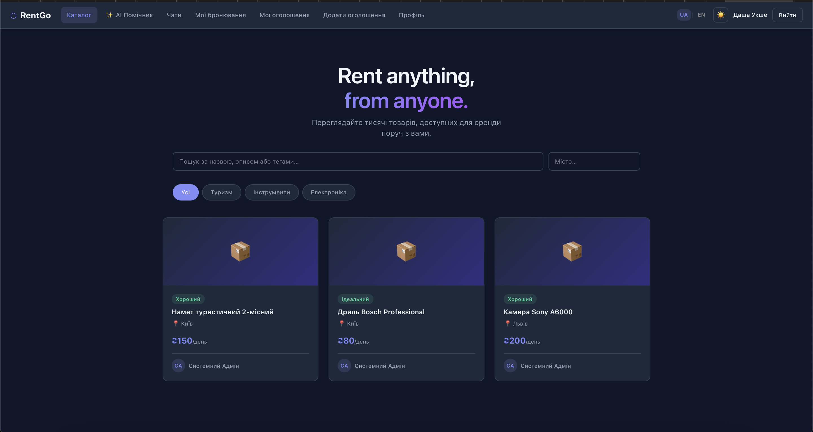

*Скріншот 4. Навігаційна панель угорі (з підписами на елементи: каталог, AI-помічник, перемикач мови, перемикач теми).*

**Зміна мови інтерфейсу.** У правій частині навігаційної панелі розташовано перемикач **UA | EN**. Натисніть **UA** для української або **EN** для англійської — весь інтерфейс миттєво перекладається. Обрана мова зберігається у браузері й застосовується автоматично під час наступних відвідувань.

**Зміна теми (світла / темна).** Поруч із перемикачем мови є кнопка теми: **🌙** перемикає на темну тему, **☀️** — назад на світлу. Вибір зберігається у браузері; за замовчуванням використовується тема, налаштована у вашій операційній системі.

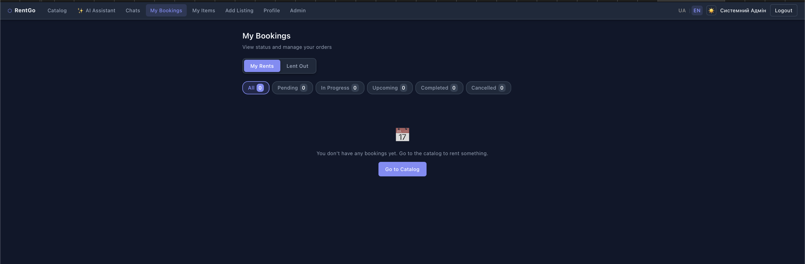

*Скріншот 24. Інтерфейс англійською мовою з темною темою.*

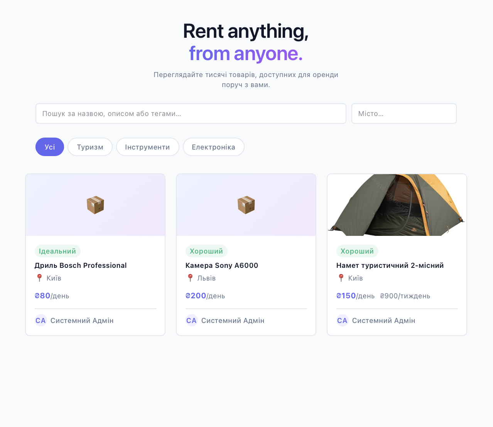

*Скріншот 25. Інтерфейс українською мовою зі світлою темою.*

## 2.2. Реєстрація та вхід

**Реєстрація:**

1. Натисніть **Реєстрація** у правому верхньому куті.
2. Введіть email і пароль (з підтвердженням пароля).
3. Підтвердьте — після успішної реєстрації ви автоматично авторизуєтесь.

**Вхід:**

- За email і паролем на сторінці **Вхід**;
- Або через **Google** (кнопка входу через Google), якщо входите через свій account Google.

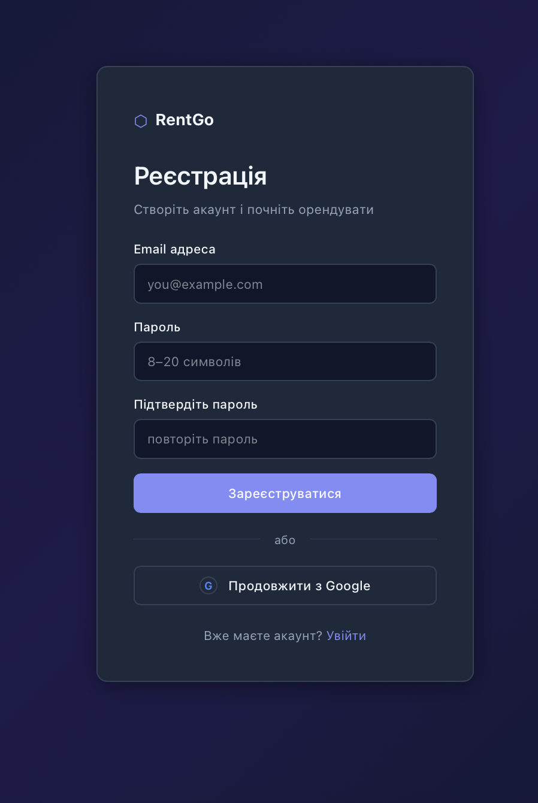

*Скріншот 5. Форма реєстрації.*

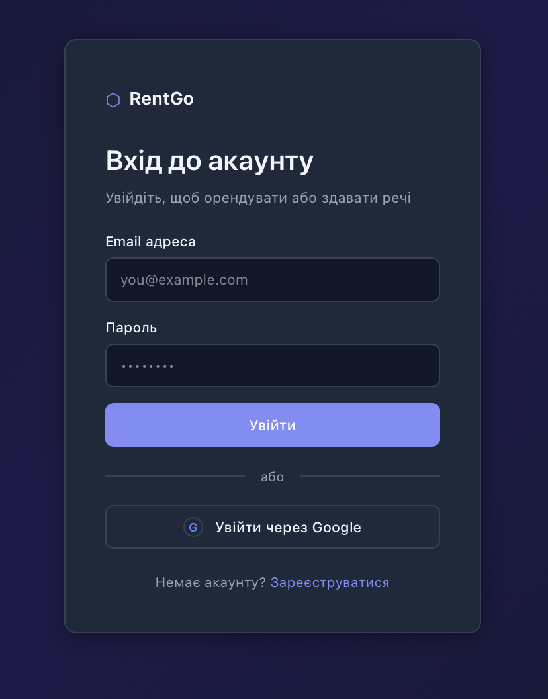

*Скріншот 6. Форма входу (з кнопкою «Увійти через Google»).*

## 2.3. Каталог і пошук речей

Каталог — стартова сторінка платформи. Тут можна:

- **Шукати за назвою** — поле пошуку;
- **Фільтрувати за містом** — поле введення міста;
- **Фільтрувати за категорією** — клік на кнопку категорії (наприклад, Туризм, або **Усі** для скидання фільтра);
- **Гортати сторінки** — пагінація внизу списку.

Кожна картка речі показує зображення, назву, ціну за день (₴) та за тиждень.

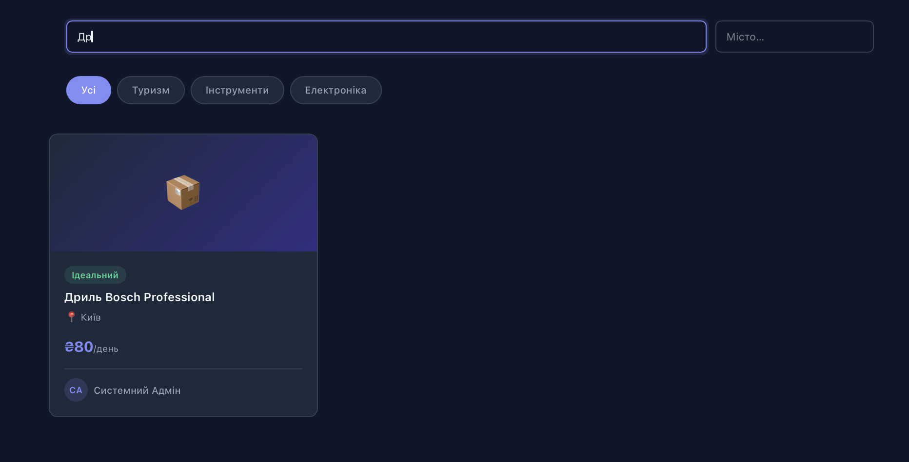

*Скріншот 7. Каталог: поле пошуку, фільтр за містом, чіпи категорій та сітка карток речей.*

## 2.4. Сторінка речі

Клік на картку відкриває детальну сторінку, де відображено:

- **Галерею фотографій**: велике головне зображення та мініатюри решти фото. Клік на фото відкриває його на весь екран (lightbox) із перегортанням стрілками вперед/назад;
- **Стан речі** (ідеальний, хороший тощо), позначку **✓ Перевірено** для верифікованих речей;
- **Ціну за день і за тиждень**, суму **застави** (депозиту);
- **Опис** і **теги**;
- Блок **Власник**: ім'я, рейтинг довіри (⭐ Trust Score) та кількість успішних оренд;
- **Відгуки про власника**;
- Блок **бронювання** з календарем доступності.

Якщо ви — власник цієї речі, замість форми бронювання відображаються кнопки **Редагувати** та **Видалити**.

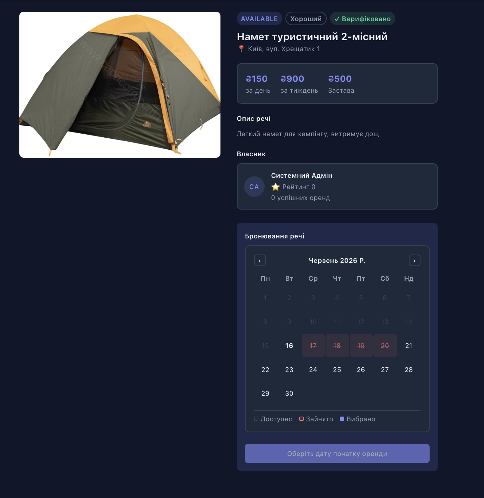

*Скріншот 8. Сторінка речі: галерея фото (головне зображення + мініатюри), ціни, опис, блок власника з рейтингом довіри та відгуками.*

## 2.5. Бронювання та календар доступності

На сторінці речі (для авторизованого користувача, що не є власником):

1. У **календарі доступності** виберіть діапазон дат — початок і кінець оренди. Зайняті дати позначені й недоступні для вибору, що захищає від **подвійного бронювання**.
2. Календар автоматично порахує орієнтовну вартість (ціна за день × кількість днів) та суму застави.
3. Натисніть кнопку бронювання (**Забронювати та написати**) — створюється запит на оренду й відкривається чат із власником.

Якщо ви не авторизовані, замість форми буде запрошення увійти або зареєструватися.

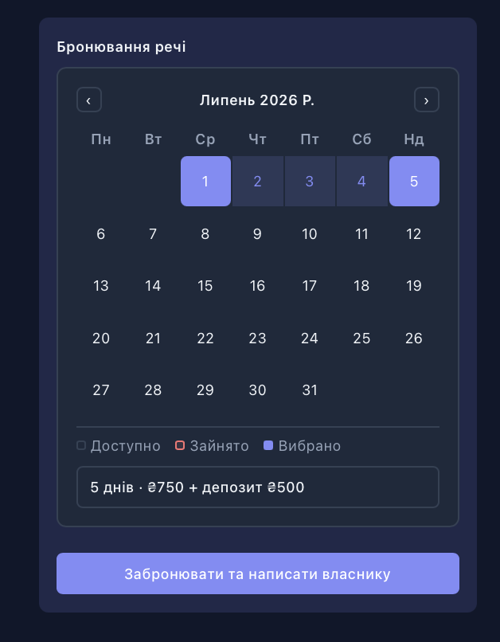

*Скріншот 9. Календар доступності з виділеним діапазоном дат і підрахованою вартістю.*

## 2.6. Додавання та редагування власних оголошень

Щоб здати річ в оренду, натисніть **Додати оголошення** в навігації та заповніть форму:

- **Назва** (обов'язково);
- **Категорія** (обов'язково);
- **Опис**;
- **Стан речі** (обов'язково);
- **Теги** (через кому);
- **Ціна за день**, **Ціна за тиждень**, **Сума застави** (обов'язково);
- **Місто** та **Адреса** (обов'язково);
- **Фотографії** — додайте фото вашого товару.

Після збереження річ з'являється в каталозі. Власні оголошення редагуються або видаляються зі сторінки речі (кнопки **Редагувати** / **Видалити**).

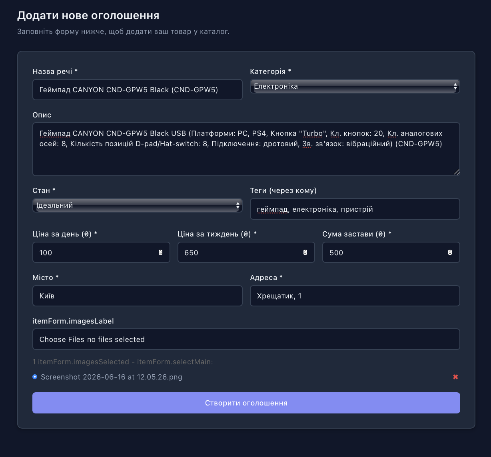

*Скріншот 10. Форма додавання оголошення з заповненими полями та вибраними фото (видно список фото з позначкою головного зображення).*

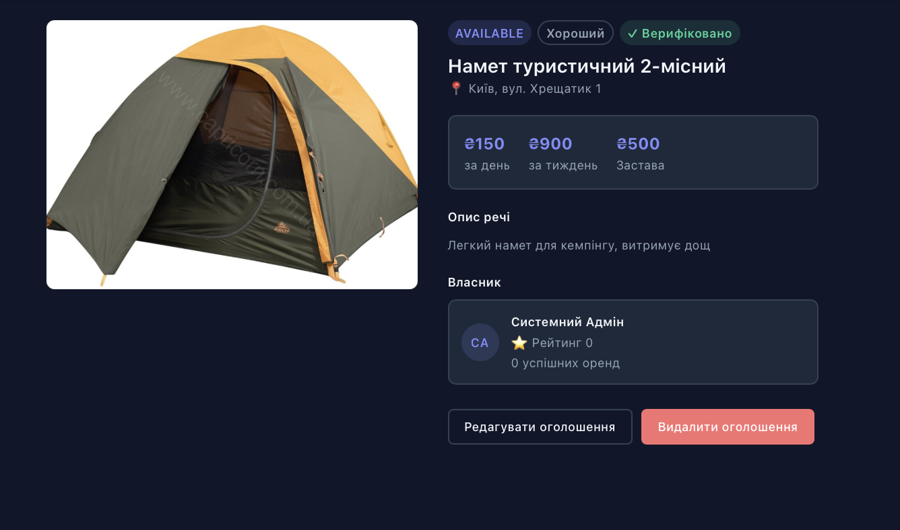

*Скріншот 11. Сторінка власної речі з кнопками «Редагувати» і «Видалити».*

## 2.7. Мої оголошення

Сторінка **Мої оголошення** показує сіткою всі оголошення, які ви додали як власник. Для кожної речі видно стан, статус верифікації (перевірено / на розгляді), місто та ціну. Клік на картку відкриває сторінку речі, де її можна редагувати або видалити. Якщо оголошень ще немає, сторінка пропонує одразу **Додати оголошення**.

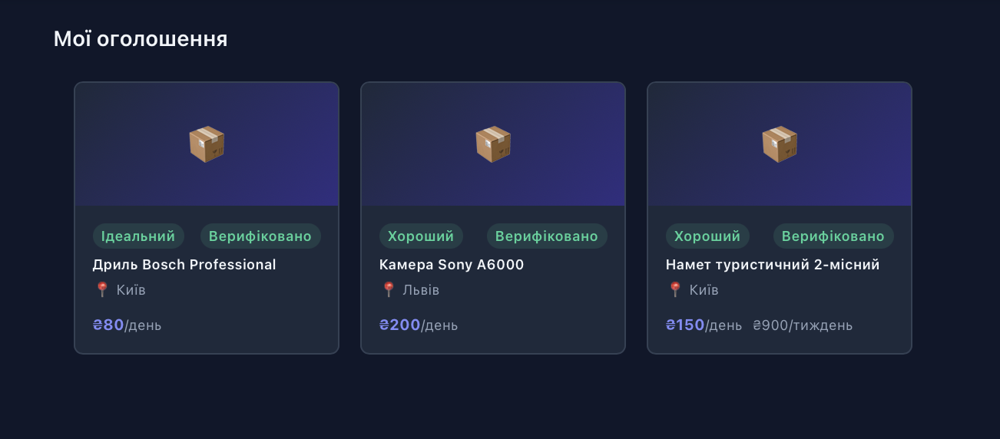

*Скріншот 12. Сторінка «Мої речі»: сітка власних оголошень зі статусами.*

## 2.8. Мої бронювання (орендар і власник)

Сторінка **Мої бронювання** має дві вкладки:

- **Оренди** — бронювання, які ви створили як **орендар**;
- **Пропозиції** — запити на ваші речі, де ви — **власник**.

Усередині кожної вкладки є фільтри за статусом (наприклад, **Усі**, **Очікують**).

Доступні дії залежно від ролі та статусу:

- **Власник** може **підтвердити** або **відхилити** запит, а після завершення оренди — позначити її **завершеною**;
- **Орендар** може **скасувати** своє бронювання, а для підтвердженого бронювання — **оплатити** його (див. наступний розділ).

Після кожної дії з'являється підтвердження.

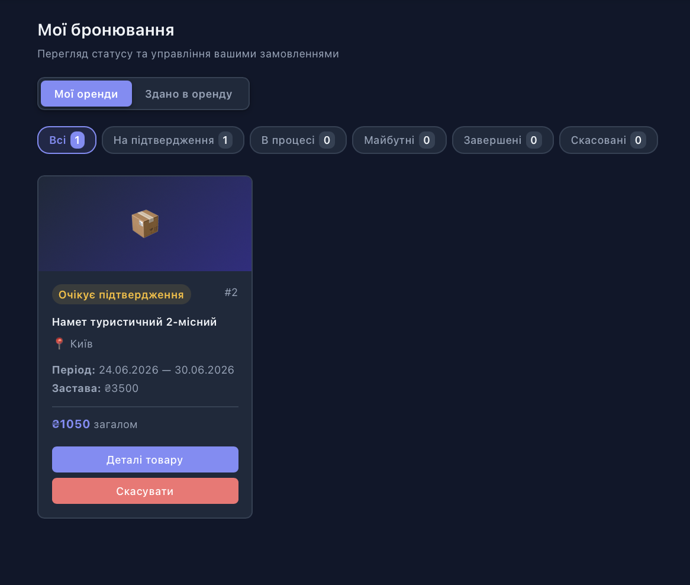

*Скріншот 13. Сторінка «Мої бронювання»: вкладки «Оренди» / «Пропозиції» та список бронювань зі статусами й кнопками дій (зокрема «Оплатити (LiqPay)»).*

## 2.9. Оплата бронювання (LiqPay)

Оплата виконується орендарем після підтвердження бронювання власником:

1. На сторінці **Мої бронювання** у відповідному бронюванні натисніть **Оплатити (LiqPay)**.
2. Система створює платіж і перенаправляє вас на платіжну сторінку.
3. Після підтвердження ви повертаєтесь на сторінку **Мої бронювання** з оновленим статусом.

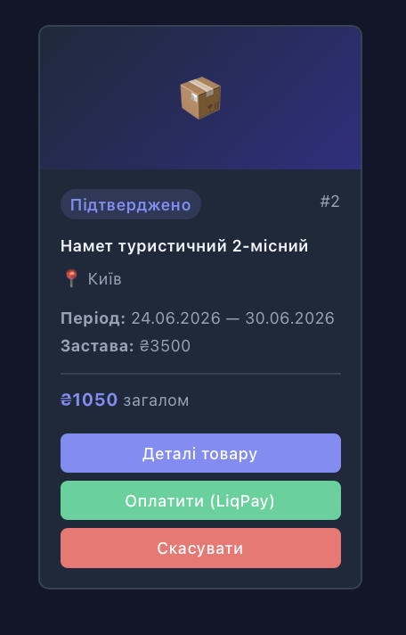

*Скріншот 14. Оплата з LiqPay.*

## 2.10. Чати

Сторінка **Чати** містить список діалогів, прив'язаних до бронювань. Клік на діалог відкриває чат із співрозмовником (власником або орендарем) із обміном повідомленнями в реальному часі.

Чат із власником також відкривається автоматично під час створення бронювання.

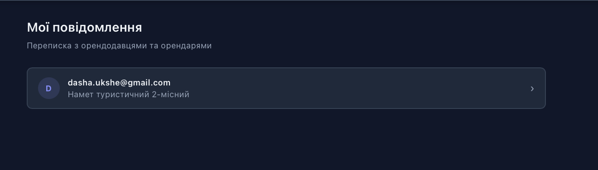

*Скріншот 15. Список чатів.*

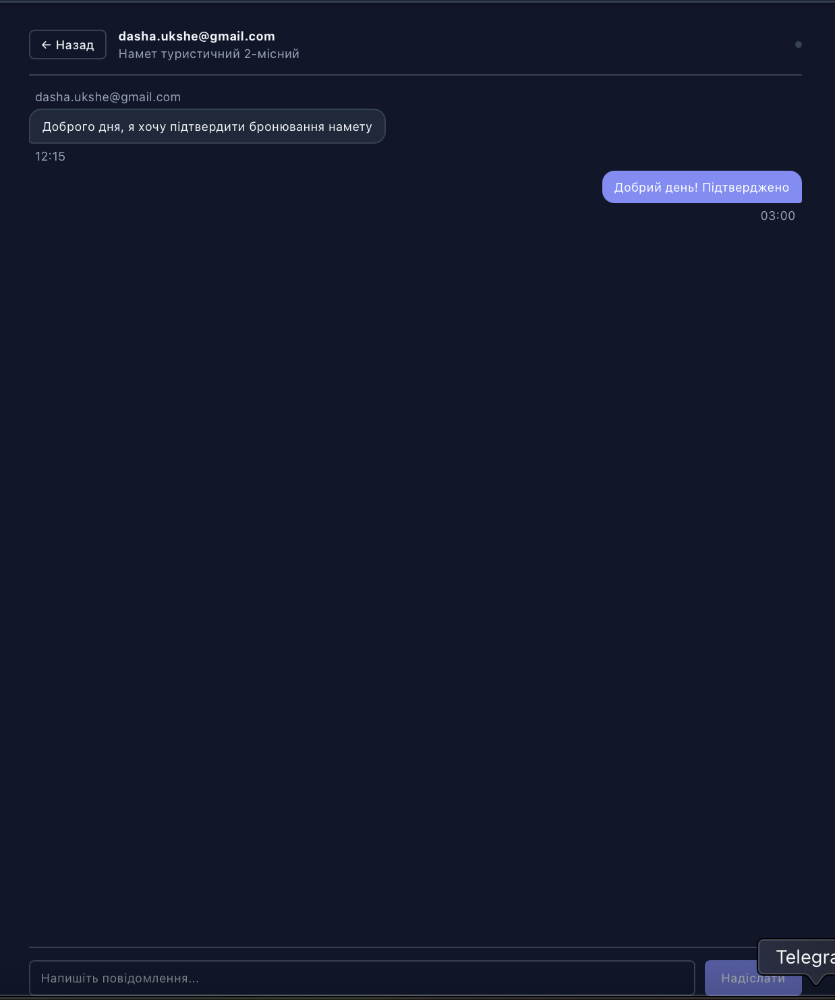

*Скріншот 16. Вікно чату з повідомленнями.*

## 2.11. AI-асистент

Сторінка **AI-помічник** підбирає речі за вільним текстовим описом ситуації:

1. Опишіть свою потребу в полі вводу (наприклад, *«їду на три дні в Карпати»*) або скористайтеся прикладами-підказками.
2. Натисніть кнопку запиту.
3. Асистент поверне рекомендовані речі з каталогу. Якщо підходящих позицій немає — буде запропоновано переформулювати запит.

AI-асистент доступний без входу.

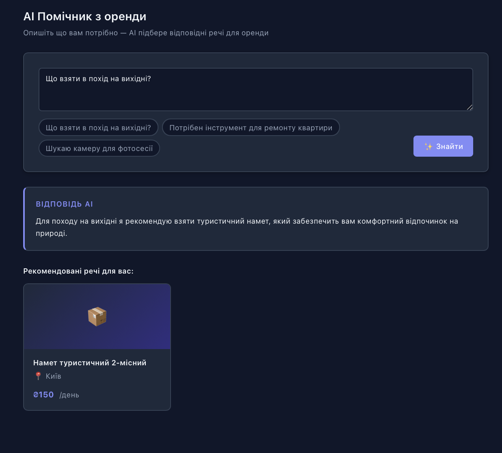

*Скріншот 17. AI-помічник: поле вводу запиту, приклади-підказки та блок рекомендованих речей.*

## 2.12. Профіль і верифікація

Сторінка **Профіль** дозволяє:

- Завантажити та змінити **аватар**;
- Заповнити дані: **ім'я**, **прізвище**, по батькові, **дату народження**, **телефон**;
- Подати **запит на верифікацію особистості** (ручна перевірка адміністратором);
- Переглянути статистику: **кількість оренд**, **рейтинг орендаря** та **рейтинг власника**, поточний **статус верифікації** (не верифіковано / на розгляді / верифіковано / відхилено).

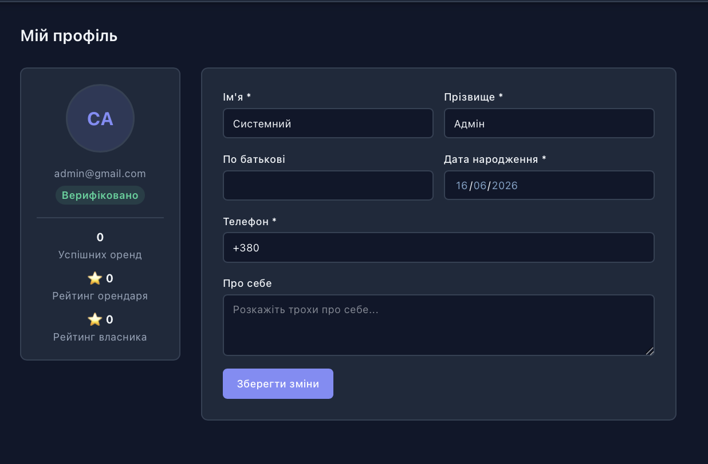

*Скріншот 18. Сторінка профілю: аватар, особисті дані, статус верифікації та рейтинги довіри.*

## 2.13. Відгуки та система довіри

Після завершення оренди обидві сторони можуть залишити **двосторонній відгук** — власник оцінює орендаря, а орендар власника. Відгуки впливають на **Trust Score** (рейтинг довіри), який відображається на сторінці речі та у профілі. Система довіри також включає **верифікацію особистості** та накопичувану **кількість успішних оренд**.

## 2.14. Адміністративна панель

Доступна лише користувачам із роллю **ADMIN** (пункт **Адмін** у навігації). Дозволяє:

- Переглядати та модерувати **оголошення** (схвалення речей);
- Керувати **користувачами** (зокрема обробляти запити на верифікацію, блокування);
- Переглядати **бронювання**;
- Бачити **статистику платформи** (кількість користувачів, активні оренди, популярні категорії).

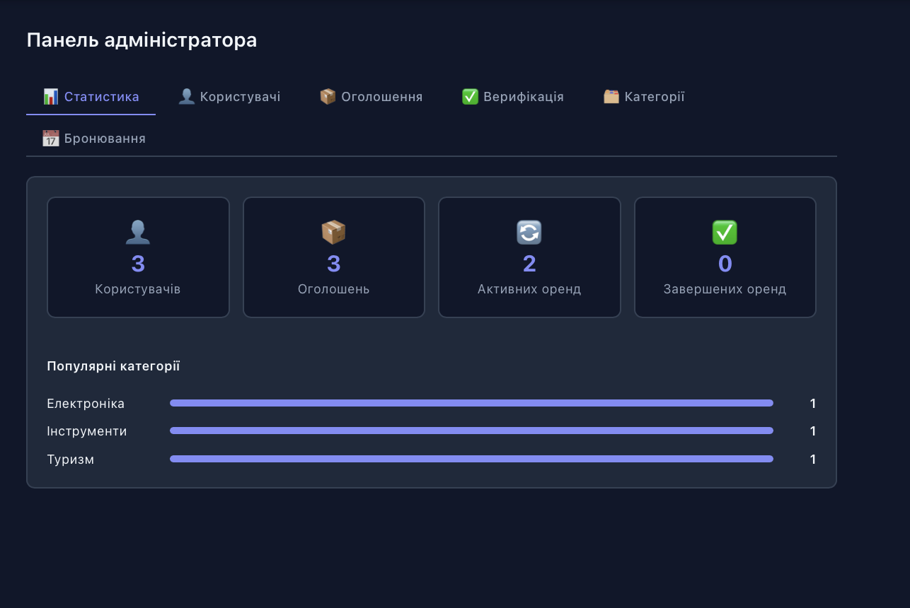

*Скріншот 19. Адмін-панель: загальний вигляд і статистика платформи.*

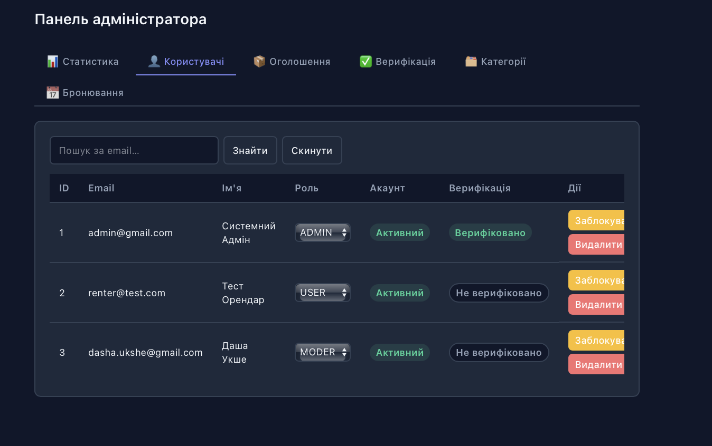

*Скріншот 20. Адмін-панель: керування користувачами.*

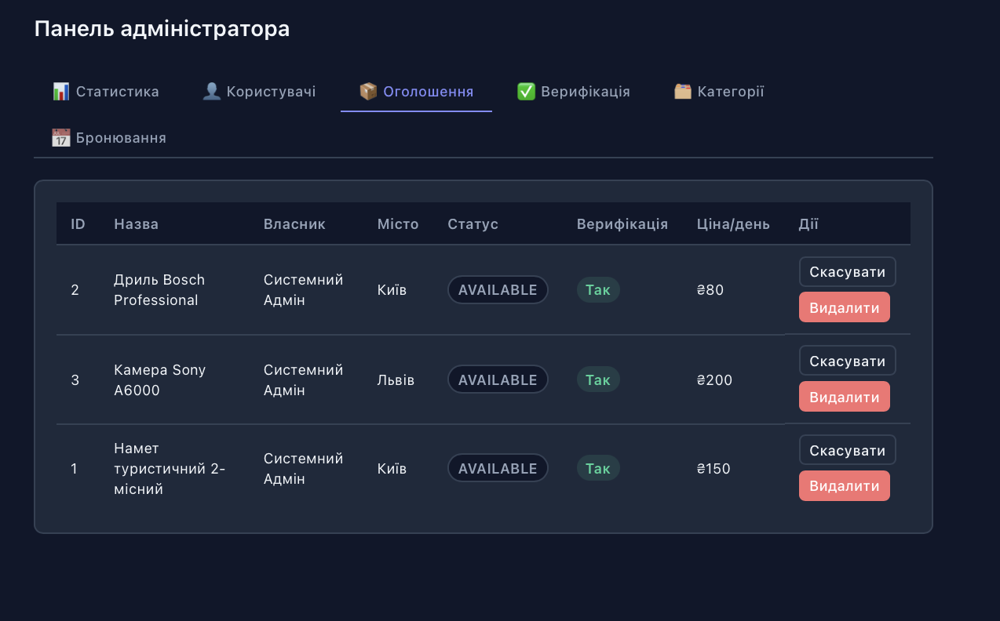

*Скріншот 21. Адмін-панель: модерація оголошень.*

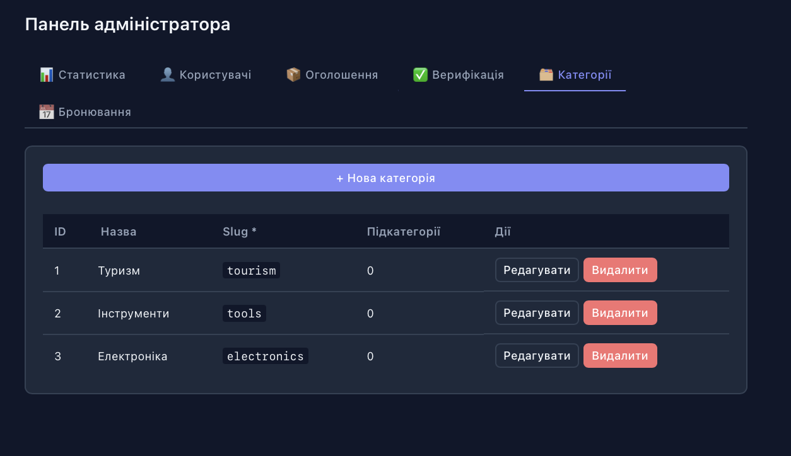

*Скріншот 22. Адмін-панель: перегляд бронювань.*

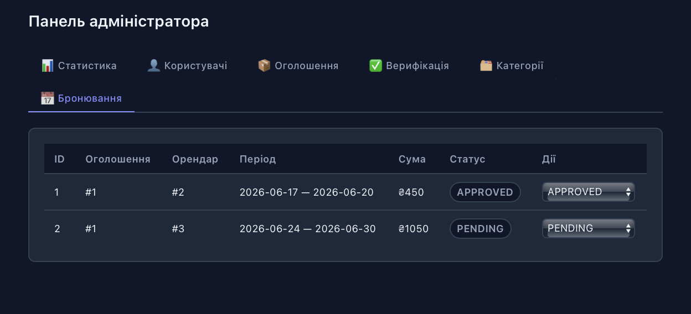

*Скріншот 23. Адмін-панель: додаткові дані / статистика.*

---

# Додаток. Типові проблеми

| Симптом | Можлива причина та рішення |
|---|---|
| Фронтенд не отримує дані, помилки в консолі | Не запущено бекенд або БД. Перевірте `docker compose ps` і `./gradlew bootRun`. |
| Бекенд не стартує, помилка підключення до БД | Не піднято контейнер PostgreSQL або невірні `DB_*` у `backend/.env`. |
| Не працює вхід через Google | Не заповнені `OAUTH2_CLIENT_ID` / `OAUTH2_CLIENT_SECRET` у `.env`. |
| AI-помічник повертає помилку | Не заданий `OPENAI_API_KEY` у `.env`. |
| Порт `8080` або `5173` зайнятий | Зупиніть процес, що використовує порт, або змініть порт (`SERVER_PORT` для бекенду). |
